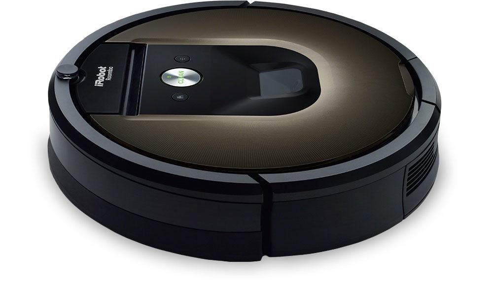

```{r setup, include=FALSE}
knitr::opts_chunk$set(echo = FALSE)
```

## Outline

1.  What is reinforcment learning?
2.  QLearning
3.  Deep Q-network (how did AlphaGo do it?)

## Introduction

Reinforcement Learning has many names or "sub-headings" associated with it. It is part of machine learning concerned with:

*  Building _software agents_
*  AI based _decision making_
*  Allowing Robots to _autonomously_ learn through trial and error

## What is and isn't Reinforcement Learning


## 1. Markov Decision Process

<!-- input diagram stolen from online--> 


<!--
## 1. Markov Decision Process

**Notes**

*  Rules of the game are unknown to the agent
*  Only have a reward signal
*  Feedback (is it a good or bad action) is delayed
*  Actions will affect subsequent data it receives
-->)

## 1. Three branches of Machine Learning

Machine learning has three broad areas:

1.  Supervised Learning
2.  Unsupervised Learning
3.  Reinforcement Learning


## 1. Three branches of Machine Learning

All areas are focused on finding some function/mapping $f$

1.  Supervised Learning: $y=f(x)$
2.  Unsupervised Learning: $f(x)$
3.  Reinforcement Learning: $y \stackrel{\text{z}}{=} f(x)$ 

## 1. Three branches of Machine Learning

All areas are focused on finding some function/mapping $f$

1.  Supervised Learning: $y=f(x)$
2.  Unsupervised Learning: $f(x)$
3.  Reinforcement Learning: $y \stackrel{\text{z}}{=} f(x)$ 

where $y$ is your "labels", $x$ is your given data, $z$ is ???

<!-- given x and z; so z is reward... --> 
<!-- 
## 1. What Reinforcement Learning is not

Roomba is not a robot which uses reinforcement learning, as there is no "learning" involved!

If a roomba was capable of receiving and improving based on feedback, then it would probably require a model within reinforcement learning

## 1. Reinforcement Learning

Broadly speaking two ways of approaching reinforcment learning:

1.  Change it to a search problem, use genetic programming/genetic algorithms to solve
2.  the Statistical approach, based on Markov Decision Process (MDP). This can be thought of as an extension to Markov Chains. 

This session looks solely at a subset of (2.)
-->
## 1. Markov Decision Process

Environment setup for our software agent:

*  States: agent must know about its environment
*  Action: agent must know what it is allowed to do
*  Rewards: we want to reward "good" actions and punish "bad" actions
*  Discount rate: we prefer if we "good" actions come sooner, rather than later

_If our agent had no actions it could take, and thereby no rewards/discount, then MDP simplifies to Markov Chain!_


## 1. Markov Decision Process

<!-- input diagram stolen from online--> 


<!--
## 1. Markov Decision Process

**Notes**

*  Rules of the game are unknown to the agent
*  Only have a reward signal
*  Feedback (is it a good or bad action) is delayed
*  Actions will affect subsequent data it receives
-->
## 2. Q-learning

Q-learning is one way (of many!) to solve MDP. It seeks to find the best _action_ in a given state by maximizing _expected reward_. 

**How this works**

1.  The agent access the state it is in, and the actions it can take. Initially it will randomly select an action ("exploration")
2.  A reward value will be now shown to the agent, and it will update its knowledge
3.  Go back to 1. until knowledge has converged or stopping criteria is met

## 2. Q-function

The goal of reinforcement learning is to select the best strategy which maximizes our reward. This can be solved using Bellman equation.

Bellman equation in plain(er) english:

>  Q(state, action) = immediate reward + expected future rewards

## 2. Q-function (Bellman equation)

If $s$ is the state, $a$ is action, $r$ is reward, $\gamma$ is discount rate, and $s', a'$ refer to the next state/action respectively,

$$Q(s,a) = r + \gamma \max_{a'}  Q(s', a')$$

is naturally our Q-function. 

>  Our expected reward for taking action $a$ is the immediate reward plus the discount future rewards if we take the optimal action in the next state


## 2.  Q-function (Bellman equation)

Normally to help you solve this, we simply output all combinations of $s$ and $a$ to a table, and then iteratively solve with some learning rate $\alpha$:

$$Q(s, a) \leftarrow Q(s, a) + \alpha(r + \gamma \max_{a'} Q(s', a') - Q(s, a))$$
Whenever a new state, action and reward is realised we can update this table. (see step 2 in "how this works")

**nb $r$ is typically a function**

## 2. Q-learning (Recap with Pseudo-code)

Qlearning object does 1 things:

`query(state: current state, r: previous reward)` : returns the optimal action, and updates qtable if reward is not null. If reward is null, assumes that your in initial state (i.e. no reward).


## 2. Q-learning (Recap with Pseudo-code)

**Proposed Pseudo-code**

_Initialise variables_

1.  Initialise a "Q learning table" which is the q function value for all state, action pairs (i.e. if we have 10 states, 4 actions, we will have a 10 by 4 table) - set all values to 0. 
2.  Intiailise an exploration rate, we will randomly explore (outside of optimal action) when our random number is lower than exploration rate. As we take more actions, we will lower the exploration rate. 

## 2. Q-learning (Recap with Pseudo-code)

_Algorithm_

1. Based on state, reward values, update qtable using

$$Q(s, a) \leftarrow Q(s, a) + \alpha(r + \gamma \max_{a'} Q(s', a') - Q(s, a))$$

2. Return action based on optimal action from Qtable or random action if random number generated is less than exploration rate.


## 2. Q-learning (Notebook examples)

Suppose we wish to train an agent to solve a maze, without the agent knowing where the start/end of the maze is. All it knows is that it can make an action, and the resulting action will yield a reward. This can be solved in RL. 

Inputs:

*  reward 1 if it is in the end of the maze
*  reward -1 if it is anywhere else

This works because of _discounting_. It would strive to maximize reward by getting to the end in as few steps as possible!

## 2. Q-learning (Notebook examples)

Extensions to this problem is when taking an chosen action may "fail" (see frozen lake problem). That is to say, when an agent intends to move north, it can randomly also move east or west! 

This is important in many contexts when we are not in full control of the environment. For example Customer marketing models. 

## 3. Deep Q-Networks (DQN)

DQN are very similar to traditional Q-learning, the only difference is that the table of transitions will now be approximated and replaced with a neural network. 

## 3. Deep Q-Networks (DQN)

The loss function (to be optimised) is:

$$L = (r + \max_{a'} Q(s', a') - Q(s, a))^2$$

Where $r + max_{a'} Q(s', a')$ is our target and $Q(s, a)$ is the prediction. Which means this is analogous to mse:

$$ L = (y - \hat{y})^2$$


## 3. Deep Q-Networks (DQN)

Steps in Pseudo-code

1.  Based on the current model; calculate $Q(s, a)$ for all actions
2.  Then calculate the next state's associated values $r + max_{a'} Q(s', a')$
3.  Set the target for calculated action in step 2 to be the target for neural network, everything else is the target as calculated in step 1
4.  Update weights for neural network! (backprop)

## 3. Deep Q-Networks (DQN) - Considerations

Uses neural network to estimate the Q function. 

Any sufficiently complex neural network can replicate any function! ([Universal Approximation Theorem](https://en.wikipedia.org/wiki/Universal_approximation_theorem)):

*  http://neuralnetworksanddeeplearning.com/chap4.html


- for "simple" problems, this may result in an overly complicated structure

Seems to do well when problem is "ill-defined" with respect to how a human may logically explain how to train an agent (e.g. play computer games via pixels on a screen)

## 3. Deep Q-Networks (DQN) - Considerations

Simplified Breakout example (see notebook)

## 4. Further examples

Toolkits:

*  Burlap (Java)
*  MDPtoolbox (R/Python/MATLAB)
*  OpenAI

Roll your own using DeepLearning Frameworks

## 5. Practical applications

*  [Parameter optimization](https://gym.openai.com/envs#parameter_tuning)
*  Customer Journey models, [customer call center](http://rankminer.com/reinforcement-learning-big-data-in-call-centers/)
*  High frequency trading models
*  Multi-arm bandit problems; generalising AB testing (e.g. for selecting "best" models in production)

## Considerations

The most important part of RL is not the particular model, but it is the representation of your states and actions, as well as your reward function. 

